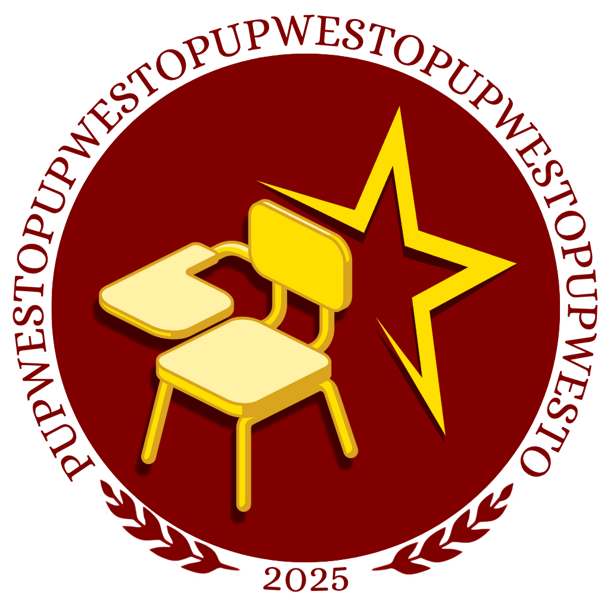

# PUPwesto - Classroom & Laboratory Booking System



A modern, web-based room reservation system designed specifically for the Polytechnic University of the Philippines' Main Academic Building. PUPwesto streamlines the process of booking classrooms and laboratories, making resource management efficient and hassle-free.

## 🌟 Features

### For Users
- **Real-Time Availability Checking**: Instantly view available rooms and their schedules
- **Smart Booking System**: Prevents double bookings and scheduling conflicts
- **Equipment Requests**: Book additional equipment like:
  - LED/LCD TVs
  - Projectors
  - VGA/HDMI cables
  - Extension cords
- **User Dashboard**: Track your current and past reservations
- **Mobile Responsive**: Access the system from any device

### For Administrators
- **Comprehensive Management**: Oversee all room reservations
- **User Management**: Manage user accounts and permissions
- **Room Management**: Update room availability and status
- **Equipment Tracking**: Monitor equipment allocation
- **Approval Workflow**: Review and approve booking requests

## 🚀 System Impact
- 95% Reduction in Booking Conflicts
- 60% Time Saved in Administrative Tasks
- 100% Transparency in Room Availability
- 24/7 Booking Accessibility

## 💻 Technologies Used
- **Frontend**: HTML5, CSS3, JavaScript
- **Backend**: PHP
- **Database**: MySQL
- **Server**: Apache (XAMPP)

## 📋 Prerequisites
- PHP 8.2 or higher
- MySQL 10.4 or higher
- Apache Web Server
- XAMPP (recommended)

## 🛠️ Installation

1. Clone the repository:
   ```bash
   git clone https://github.com/juanmayaman/PUPwesto.git
   ```

2. Set up your XAMPP environment:
   - Place the project in your XAMPP's `htdocs` directory
   - Start Apache and MySQL services

3. Database setup:
   - Create a new database named 'pupwesto'
   - Import the provided SQL file
   - Configure database connection in `config/db_connect.php`

4. Access the application:
   ```
   http://localhost/PUPwesto
   ```

## 📁 Project Structure
```
PUPwesto/
├── admin/           # Administrator interface
├── config/          # Configuration files
├── images/          # Image assets
├── main/           # Main application files
└── users/          # User-specific functionality
```

## 🔐 Security Features
- Session-based authentication
- Prepared SQL statements
- Input validation and sanitization
- Role-based access control

## 👥 User Roles
1. **Students/Faculty**
   - Book rooms and equipment
   - View personal booking history
   - Manage profile

2. **Administrators**
   - Manage all reservations
   - Handle user accounts
   - Configure system settings

## 📝 Guidelines
- Reservations can be made up to 7 days in advance
- Maximum booking duration: 4 hours
- Room capacity must be respected
- Equipment requests subject to availability

## 🤝 Contributing
Contributions are welcome! Please feel free to submit a Pull Request.

## 📧 Contact
For inquiries and support:
- Email: pupwesto@gmail.com
- Location: Polytechnic University of the Philippines
  Anonas Street, Sta. Mesa, Manila, Philippines 1016

## 🙏 Acknowledgments
- PUP Administration for their support
- Faculty and students for valuable feedback
- XAMPP development team
- All contributors to this project

## Authors
- Joanne Aldover
- Ed Marcel Lasco
- Sophia Lizarondo
- Charles Lucas
- John Rich Nicolas
